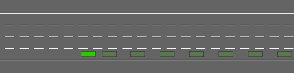

# UPS---Deep-Q-Learning-Autonomous-Vehicle

Aim: Speed and lane decision making for an autonomous vehicle in a highway environment. 

Method: Learning using Deep Q-Network

Environment: highway-env by [eleurent](https://github.com/eleurent/highway-env)

**highway-v0**

     
    <em>The highway-v0 environment.</em>

